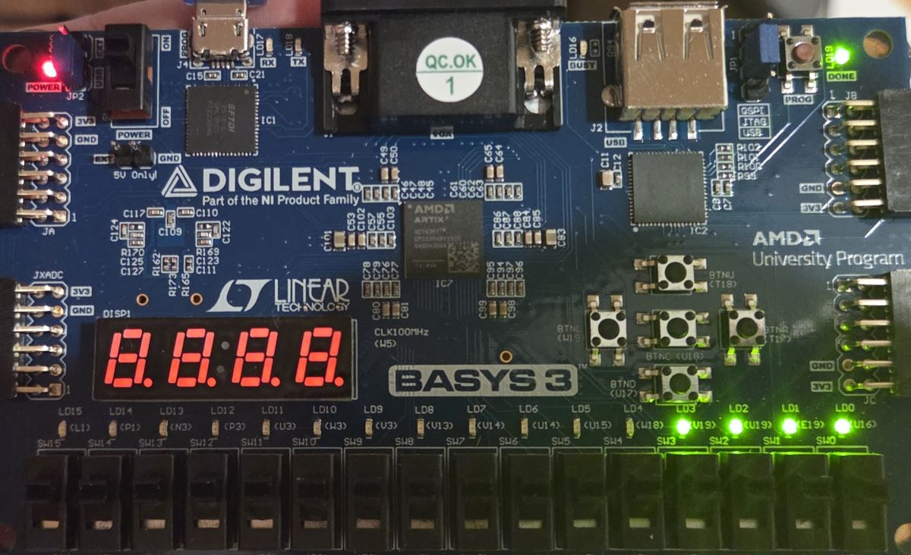

# 01 — Switches to LEDs

A minimal combinational design mapping the four rightmost slide switches to the four rightmost LEDs on the Basys 3. The purpose is to exercise the complete flow — RTL, constraints, synthesis, implementation, bitstream generation, and hardware programming — before moving to sequential designs.

## Design

```verilog
module top(
    input  [3:0] sw,
    output [3:0] led
);
    assign led = sw;
endmodule
```

The `assign` statement is a continuous assignment, not a sequential instruction. It describes a permanent connection between the switch inputs and LED outputs that exists in hardware once the bitstream is loaded — there is no clock, no state, and no execution order.

## Pin assignments

Constraints map the module's logical ports to physical package pins. The Verilog itself has no knowledge of switches or LEDs; the XDC establishes that binding.

| Signal | Pin | Board component |
|--------|-----|-----------------|
| `sw[0]` | V17 | SW0 |
| `sw[1]` | V16 | SW1 |
| `sw[2]` | W16 | SW2 |
| `sw[3]` | W17 | SW3 |
| `led[0]` | U16 | LD0 |
| `led[1]` | E19 | LD1 |
| `led[2]` | U19 | LD2 |
| `led[3]` | V19 | LD3 |

All I/O uses the `LVCMOS33` standard, matching the Basys 3's 3.3 V I/O bank supply.

## Result

Each switch drives its corresponding LED. Response is immediate — propagation is limited only by I/O buffer delay, on the order of nanoseconds.



## Debugging notes

**Factory demo persisted after programming.** After programming reported success, the seven-segment display continued running the factory counter demo and the LEDs did not respond correctly. Cause: the MODE jumper (JP1) was in the QSPI position, so the FPGA configured itself from onboard flash at power-up rather than accepting the JTAG-programmed bitstream. Moving the jumper to JTAG resolved it.

**Implementation does not produce a bitstream.** Running Implementation to completion leaves no `.bit` file. Generate Bitstream is a separate step in the Flow Navigator, and skipping it leaves the Program Device dialog with no valid bitstream path.

Seven-segment display shows all segments illuminated. The digit-enable lines and segment cathodes are unconstrained and undriven in this design, so they float to weak pull-up levels. Because the display uses active-low enables, all four digits are enabled simultaneously and every segment and decimal point is driven, displaying 8.8.8.8.. This is expected for a design that does not drive those pins. Constraining the anode signals and driving them high (assign an = 4'b1111;) blanks the display.

## Build

Vivado ML Standard 2025.2, targeting `xc7a35tcpg236-1`. Set JP1 to JTAG before programming.
