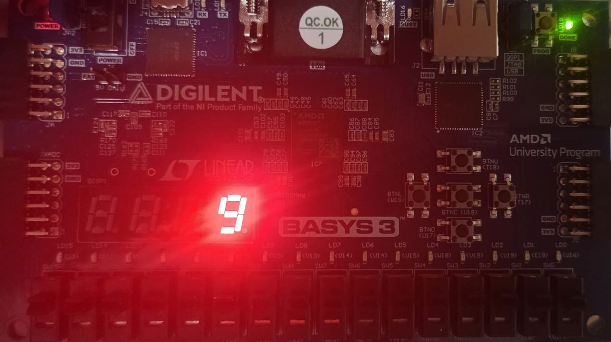

# 02 — Seven-Segment Decimal Counter

A single-digit decimal counter driving the Basys 3's seven-segment display. The value increments once per second from 0 to 9 and rolls over. This is the first sequential design in the repository and introduces clock division, enable-based timing, and combinational decoding.

Multiplexing across all four digits is a planned extension; this version drives AN0 only.

## Architecture

Three modules wired together in `top`:

```
clk (100 MHz) ──→ [tick_generator] ──tick──→ [decimal_counter] ──value[3:0]──→ [seven_segment] ──seg[6:0]──→ display
```

| Module | Type | Function |
|--------|------|----------|
| `tick_generator` | Sequential | Divides 100 MHz down to a one-cycle enable pulse at 1 Hz |
| `decimal_counter` | Sequential | Increments 0–9 on each enable pulse, rolls over |
| `seven_segment` | Combinational | Maps a 4-bit value to seven active-low segment signals |

`tick_generator` is parameterized (`DIV_VALUE`, `WIDTH`) so the same module can be instantiated at other rates — the planned multiplexing extension reuses it at 240 Hz without modification.

## Single clock domain

Every flip-flop in the design is clocked by the 100 MHz system clock. Slower timing is achieved with **enable pulses** rather than derived clocks:

```verilog
always @(posedge clk) begin
    if (tick) begin
        // update
    end
end
```

`tick` is high for exactly one clock cycle per second. The counter's flip-flops see 100 million clock edges per second and update on one of them.

The alternative — `always @(posedge tick)` — would create a second clock domain driven by logic rather than a dedicated clock pin. That prevents full static timing analysis, bypasses the FPGA's low-skew global clock routing, and introduces clock-domain-crossing hazards. The enable pattern avoids all of it and maps directly onto the clock-enable input already present on every FPGA flip-flop, so it costs no additional logic.

## Segment encoding

Both the anodes and the cathodes are **active-low**. Per the Basys 3 reference manual, illuminating a segment physically requires the anode high and the cathode low, but the PNP transistors that source current into the common anode point invert the control signal — so the FPGA drives both low when active.

Encoding is `seg[6:0] = gfedcba`, where `0` lights a segment:

| Digit | gfedcba | Digit | gfedcba |
|-------|---------|-------|---------|
| 0 | 1000000 | 5 | 0010010 |
| 1 | 1111001 | 6 | 0000010 |
| 2 | 0100100 | 7 | 1111000 |
| 3 | 0110000 | 8 | 0000000 |
| 4 | 0011001 | 9 | 0010000 |

The `case` statement includes a `default` returning all segments off. Without a default, an unlisted input value leaves the output unassigned and the synthesizer may infer an unintended latch.

## Timing calculation

For a one-cycle enable pulse (as opposed to a toggling square wave, which halves the output frequency):

```
DIV_VALUE = (100,000,000 / target_Hz) - 1
```

At 1 Hz: `DIV_VALUE = 99,999,999`, requiring 27 bits since 2²⁶ = 67,108,864 is insufficient.

The `-1` accounts for the counter starting at zero — counting 0 through 99,999,999 is exactly 100,000,000 cycles.

## Debugging notes

**Anode index mapped in reverse.** On first programming, the leftmost digit counted instead of the rightmost. AN0 is the *rightmost* digit on the Basys 3; the constraints file had the anode bits assigned in the opposite order, so `an = 4'b1110` enabled AN3.

**Register width is not inferred from the value.** An earlier version of the clock divider declared the counter as `integer`, which is always 32 bits in Verilog regardless of the range actually used. Inspecting the post-synthesis schematic showed 32 flip-flops where 26 were sufficient. Declaring `reg [WIDTH-1:0]` both sizes the register correctly and makes it unsigned, which is the appropriate type for a counter.

**Pulse versus square wave changes the divisor by 2×.** A toggling output completes one full cycle every *two* rollovers, so converting the divider from a square-wave output to a single-cycle pulse required doubling `DIV_VALUE` to maintain the same rate. This is a common source of off-by-2× errors in baud rate generators.

**Two drivers on one net resolve to X.** During simulation, `divided_clk` read as X. The testbench had declared it as `wire divided_clk = 0;` — on a wire, `= 0` is a permanent continuous assignment, not an initial value. The design under test and the stuck assignment were both driving the net. Testbench signals driven by the DUT must be declared as `wire` with no initializer; only signals the testbench itself drives should be `reg` with an initial value.

## Build

Vivado ML Standard 2025.2, targeting `xc7a35tcpg236-1`. Set the MODE jumper (JP1) to JTAG before programming. Run Synthesis → Implementation → **Generate Bitstream** (implementation alone does not produce a `.bit` file), then Open Hardware Manager → Auto Connect → Program Device.


## Next steps

- Multiplex all four digits: instantiate a second `tick_generator` at 240 Hz (60 Hz refresh × 4 digits), use a 2-bit scan counter to select the active anode, and mux the corresponding digit value into the decoder.
- Add a synchronous reset.
- Write a self-checking testbench for the decoder covering all sixteen input values.
